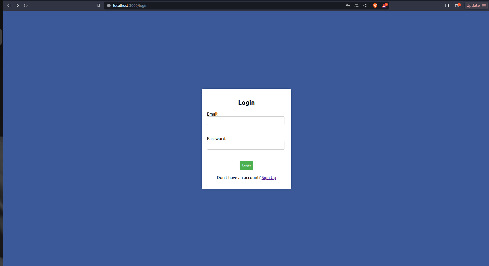
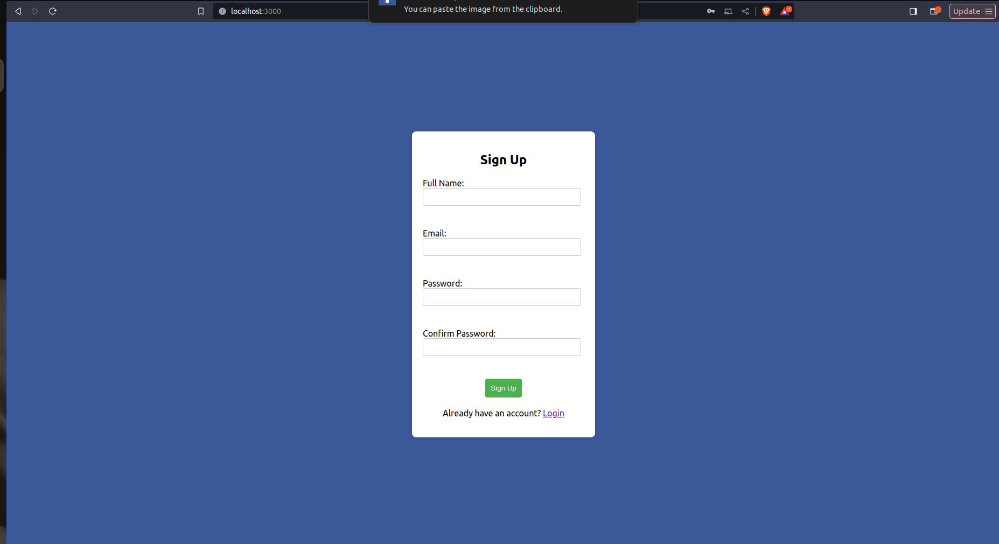
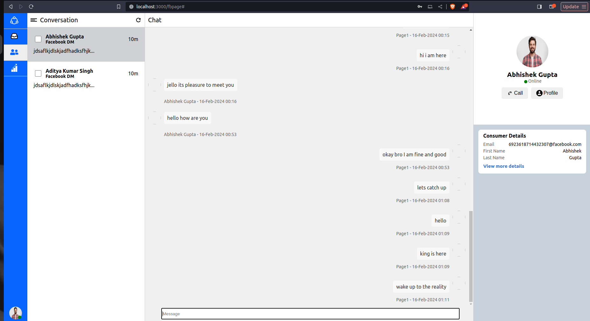
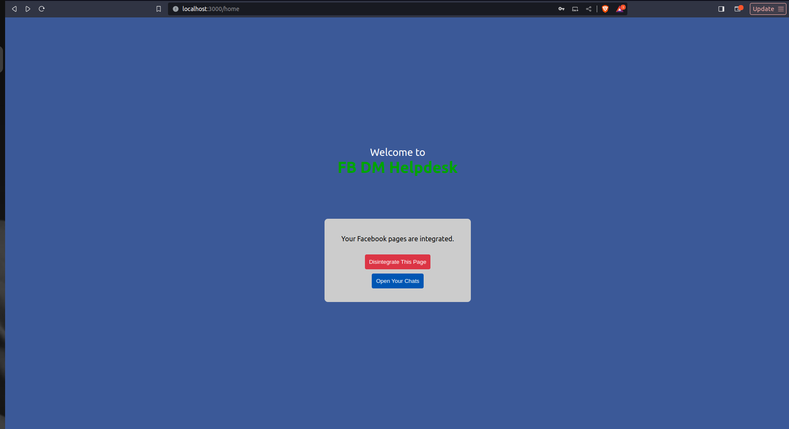

# FB DM Helpdesk

This project is an application designed to serve as a Facebook Helpdesk for businesses dealing with a high volume of messenger messages. The primary goal of the app is to simplify and streamline the process of managing and responding to Facebook messages, especially for companies receiving a large number of inquiries daily, such as e-commerce platforms like Amazon.

#### Video Demonstration Link : [Demo Video](https://drive.google.com/drive/folders/1R53mud5dOgBbOMckZyJbSGDIXwiX0f9A?usp=sharing)

## Table of Contents

- [Technologies Used](#technologies-used)
- [Features](#features)
- [Setup](#setup)
  - [Prerequisites](#prerequisites)
  - [Project Setup](#project-setup)

## Technologies Used

- **Express.js:** A web application framework for building APIs and handling server-side logic.
- **Node.js:** A runtime environment for executing JavaScript code on the server.
- **MongoDB:** A database for storing the log in and sign up records.
- **ReactJS:** A javascript based frontend framework with many in built libraries.

## Features

- **User Authentication:** Secure signup and login functionality for user accounts.
- **Facebook Page Integration:** Connects with your Facebook Page to fetch and display user chats.
- **Chat Management::** Intuitive interface for replying to messages directly from the application.

## Setup

### Prerequisites

- Node.js and npm: [Download and Install Node.js](https://nodejs.org/).

### Project Setup

1. **Clone the repository:**

   ```bash
   git clone https://github.com/abhigpta19/FBHelpdesk.git
   cd FBHelpdesk
2. **Install the dependencies:**
 
   ```bash
   npm install
3. **Start the server:**
 
   ```bash
   cd server
   npm install
   nodemon index.js
4. **Start the Client:**
 Open the same folder in new terminal
   ```bash
   cd client
   npm install
   npm start
   
## Screenshots

Here are some screenshots showcasing different aspects of the Facebook Chat Manager application:

### Login Page


### Signup Page


### Chat Interface


### Facebook Page Integration



